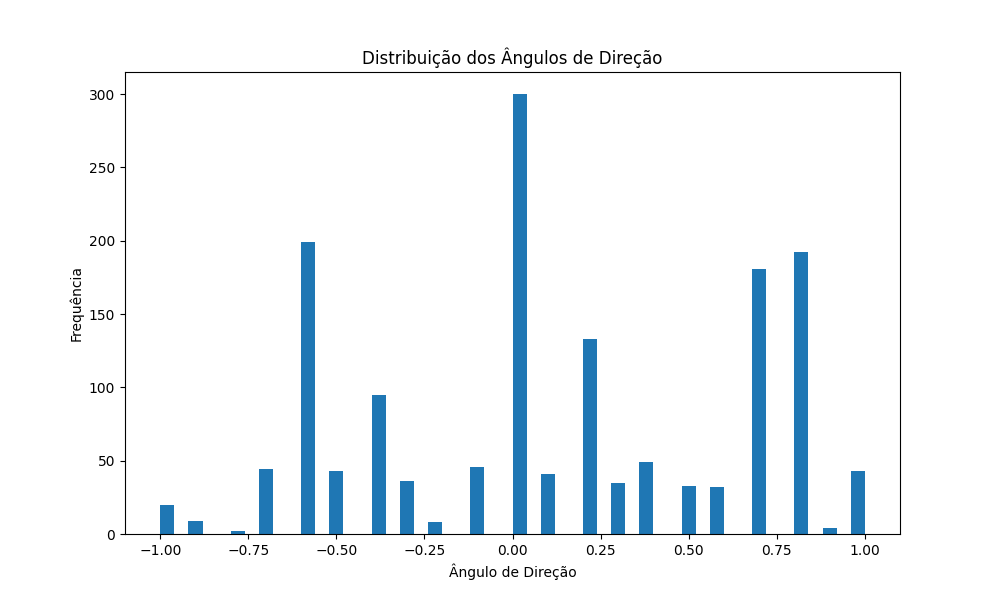
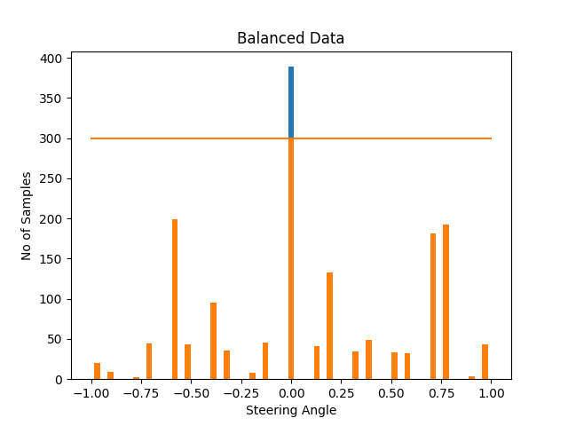
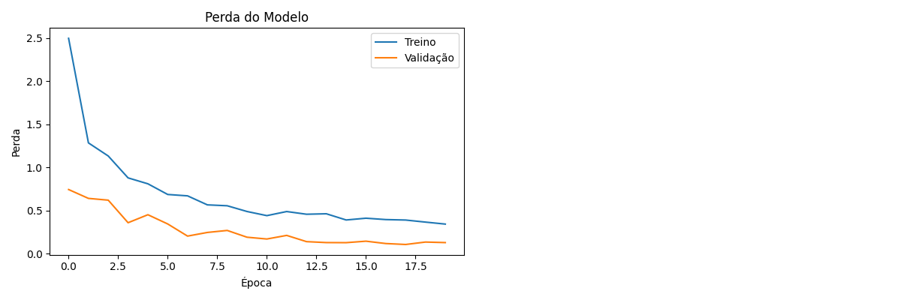

# Autonomous Driving System Documentation

## 1. Project Overview

### 1.1 Description
This project implements a deep learning-based autonomous driving system using the NVIDIA Jetson Nano platform. The system predicts steering angles from images captured by the vehicle's camera.

### 1.2 System Architecture
The system is divided into two main components:
- **Training Module (`Training.py`)**: Responsible for data collection, image preprocessing, training, and validating the neural model.
- **Testing Module (`TestModel.py`)**: Uses the trained model to predict steering angles in real-time from video input.

### 1.3 Data Flow
1. Collection of steering data through driving sessions
2. Image preprocessing and data augmentation
3. Training of the convolutional model
4. Testing the model on real driving videos
5. Visualization of results with virtual steering wheel overlay

## 2. Training Module (Training.py)

### 2.1 Main Features
- Loading multiple data sessions
- Image preprocessing and data augmentation
- Balancing the steering angle distribution
- Neural model training
- Validation and performance evaluation

### 2.2 Data Structure
The module expects data organized as follows:
```
dataset/
  ├── session_YYYYMMDD_HHMMSS/
  │   ├── steering_data.csv
  │   └── images/
  │       ├── img_001.jpg
  │       ├── img_002.jpg
  │       └── ...
  └── session_YYYYMMDD_HHMMSS/
      └── ...
```

Each session's CSV file must contain at least the following columns:
- `image_path`: Relative path to the image
- `steering`: Steering angle value (normalized)

### 2.3 Key Functions

#### 2.3.1 `find_all_sessions(base_dir="dataset")`
Locates all valid sessions in the base directory.

**Parameters:**
- `base_dir`: Base directory where sessions are stored

**Returns:**
- List of paths to valid sessions

#### 2.3.2 `load_all_sessions_data(session_dirs)`
Loads and combines data from all specified sessions.

**Parameters:**
- `session_dirs`: List of session directories

**Returns:**
- Combined DataFrame with data from all sessions

#### 2.3.3 `preProcess(img)`
Performs standard image preprocessing.

**Parameters:**
- `img`: Input image (OpenCV format)

**Returns:**
- Preprocessed image

**Steps:**
1. Crop region of interest (ROI): `img[120:480,:,:]`
2. Convert to YUV color space: `cv2.cvtColor(img, cv2.COLOR_RGB2YUV)`
3. Apply Gaussian blur: `cv2.GaussianBlur(img, (3, 3), 0)`
4. Resize to 200x66 pixels: `cv2.resize(img, (200, 66))`

#### 2.3.4 `augmentImage(img, steering)`
Applies data augmentation techniques to improve generalization.

**Parameters:**
- `img`: Original image
- `steering`: Corresponding steering angle

**Returns:**
- Augmented image and adjusted steering angle

**Applied techniques:**
- Translation (pan)
- Zoom
- Brightness adjustment
- Horizontal flipping (with angle inversion)

#### 2.3.5 `balance_data(data, display=True)`
Balances the steering angle distribution in the dataset.

**Parameters:**
- `data`: DataFrame with the data
- `display`: Flag to display distribution graphs

**Returns:**
- Balanced DataFrame

#### 2.3.6 `create_model(input_shape=(66, 200, 3))`
Creates the neural model based on NVIDIA architecture for autonomous driving.

**Parameters:**
- `input_shape`: Input image dimensions

**Returns:**
- Compiled Keras model

**Architecture:**
- Input normalization
- 5 convolutional layers with batch normalization
- 3 dense layers with dropout
- Linear output layer

### 2.4 Training Parameters
- Batch size: 32
- Epochs: 20
- Train/validation split: 80/20
- Optimizer: Adam (learning_rate=0.001, amsgrad=True)
- Loss function: MSE (Mean Squared Error)
- Metrics: MAE, RMSE

### 2.5 Callbacks Used
- `ModelCheckpoint`: Saves the best model
- `EarlyStopping`: Stops training when no improvement is seen
- `ReduceLROnPlateau`: Reduces learning rate when performance plateaus

## 3. Testing Module (TestModel.py)

### 3.1 Main Features
- Loading the trained model
- Processing input video
- Predicting steering angle
- Real-time visualization
- Virtual steering wheel overlay

### 3.2 Key Functions

#### 3.2.1 `preProcess(img)`
Identical to the preprocessing function used in training.

#### 3.2.2 `rotate_steering_wheel(image, steering_angle)`
Generates a visual representation of the steering wheel rotated according to the predicted angle.

**Parameters:**
- `image`: Current frame image
- `steering_angle`: Angle predicted by the model

**Returns:**
- Rotated steering wheel image

### 3.3 Testing Pipeline
1. Load trained model: `model = load_model('steering_model_final.keras')`
2. Open video file: `cap = cv2.VideoCapture("videos/session_.../.../video_....avi")`
3. For each frame:
   - Preprocess the frame
   - Predict angle with the model
   - Generate rotated steering wheel image
   - Overlay information and steering wheel on visualization
   - Display results

## 4. System Requirements

### 4.1 Hardware Requirements
- NVIDIA Jetson Nano
- Compatible camera
- Sufficient storage for training data

### 4.2 Software Dependencies
- Python 3.6+
- TensorFlow 2.x
- OpenCV 4.x
- NumPy
- Pandas
- Matplotlib
- scikit-learn
- imgaug

## 5. Usage Guide

### 5.1 Environment Setup
```bash
# Install dependencies
pip install tensorflow opencv-python numpy pandas matplotlib scikit-learn imgaug
```

### 5.2 Data Collection
1. Organize your data according to the expected structure
2. Each session should have a CSV file and corresponding images folder

### 5.3 Model Training
```bash
# Run the training script
python Training.py
```

The script will:
- Locate all available sessions
- Load and combine the data
- Balance the angle distribution
- Train the model
- Save results to `best_steering_model.keras` and `steering_model_final.keras`

### 5.4 Model Testing
```bash
# Run the testing script with video
python TestModel.py
```

During execution:
- Press 'q' to exit
- The system will show the original video, processed frame, and predicted angle

## 6. Results and Evaluation

### 6.1 Evaluation Metrics
Model performance is evaluated using:
- Mean Squared Error (MSE)
- Mean Absolute Error (MAE)
- Root Mean Squared Error (RMSE)

### 6.2 Generated Visualizations
- `sample_images.png`: Sample images from the dataset
- `steering_distribution.png`: Distribution of steering angles
- `balance.png`: Distribution after balancing
- `training_history.png`: Training history (loss and metrics)

#### 6.2.1 Data Distribution Analysis

The steering angle distribution shows the frequency of different steering angles in our dataset:



*Figure 1: Distribution of steering angles before balancing. Note the predominance of straight driving (0.00) and certain turning angles (-0.50, 0.75).*

After applying our balancing algorithm, we achieve a more evenly distributed dataset:



*Figure 2: Balanced steering angle distribution. The orange horizontal line indicates our target sample count per bin (300), helping ensure even representation across steering angles.*

#### 6.2.2 Training Performance

The model's training progression shows continual improvement over epochs:



*Figure 3: Training and validation loss over training epochs. The decreasing trend indicates successful model learning, with validation loss consistently lower than training loss, suggesting good generalization.*

## 7. Limitations and Future Work

### 7.1 Known Limitations
- The system works best under good lighting conditions
- Performance may be affected by adverse weather conditions
- Current model is limited to steering angle prediction (does not control acceleration/braking)

### 7.2 Potential Improvements
- Implement object and obstacle detection
- Add speed prediction
- Explore more advanced architectures (LSTM, Transformer)
- Optimize the model for better performance on the Jetson Nano

## 8. References

- [NVIDIA End-to-End Deep Learning for Self-Driving Cars](https://developer.nvidia.com/blog/deep-learning-self-driving-cars/)
- [TensorFlow Documentation](https://www.tensorflow.org/api_docs)
- [OpenCV Documentation](https://docs.opencv.org/)
- [Jetson Nano Documentation](https://developer.nvidia.com/embedded/jetson-nano-developer-kit)

---

## Appendix A: Model Architecture

```
Model: "sequential"
_________________________________________________________________
Layer (type)                 Output Shape              Param #   
=================================================================
lambda (Lambda)              (None, 66, 200, 3)        0         
_________________________________________________________________
conv2d (Conv2D)              (None, 31, 98, 24)        1824      
_________________________________________________________________
batch_normalization (BatchNo (None, 31, 98, 24)        96        
_________________________________________________________________
conv2d_1 (Conv2D)            (None, 14, 47, 36)        21636     
_________________________________________________________________
batch_normalization_1 (Batch (None, 14, 47, 36)        144       
_________________________________________________________________
conv2d_2 (Conv2D)            (None, 5, 22, 48)         43248     
_________________________________________________________________
batch_normalization_2 (Batch (None, 5, 22, 48)         192       
_________________________________________________________________
conv2d_3 (Conv2D)            (None, 3, 20, 64)         27712     
_________________________________________________________________
batch_normalization_3 (Batch (None, 3, 20, 64)         256       
_________________________________________________________________
conv2d_4 (Conv2D)            (None, 1, 18, 64)         36928     
_________________________________________________________________
batch_normalization_4 (Batch (None, 1, 18, 64)         256       
_________________________________________________________________
flatten (Flatten)            (None, 1152)              0         
_________________________________________________________________
dense (Dense)                (None, 100)               115300    
_________________________________________________________________
dropout (Dropout)            (None, 100)               0         
_________________________________________________________________
dense_1 (Dense)              (None, 50)                5050      
_________________________________________________________________
dropout_1 (Dropout)          (None, 50)                0         
_________________________________________________________________
dense_2 (Dense)              (None, 10)                510       
_________________________________________________________________
dropout_2 (Dropout)          (None, 10)                0         
_________________________________________________________________
dense_3 (Dense)              (None, 1)                 11        
=================================================================
Total params: 253,163
Trainable params: 252,691
Non-trainable params: 472
_________________________________________________________________
```

## Appendix B: System Flowchart

```
┌───────────────────┐    ┌────────────────────┐    ┌────────────────────┐
│   Data Collection │───►│  Preprocessing     │───►│  Neural Model      │
└───────────────────┘    │  and Balancing     │    │  Training          │
                         └────────────────────┘    └─────────┬──────────┘
                                                             │
                                                             ▼
┌───────────────────┐    ┌────────────────────┐    ┌────────────────────┐
│  Results          │◄───│  Real-time         │◄───│  Trained Model     │
│  Visualization    │    │  Prediction        │    │                    │
└───────────────────┘    └────────────────────┘    └────────────────────┘
```
